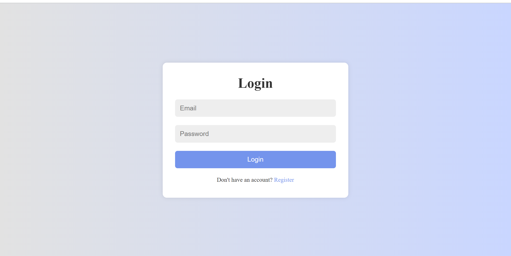
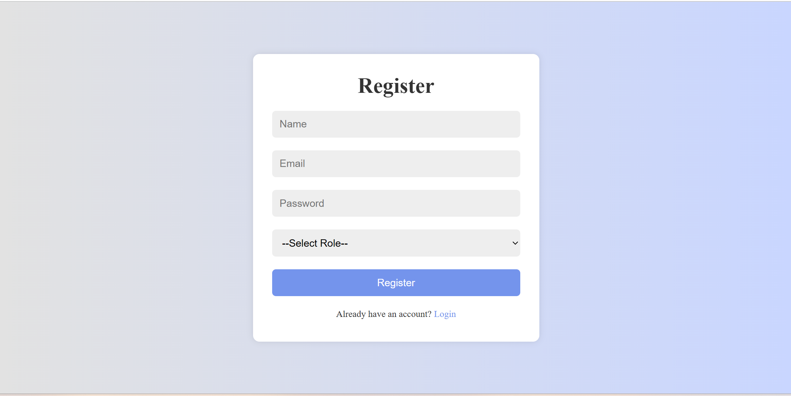
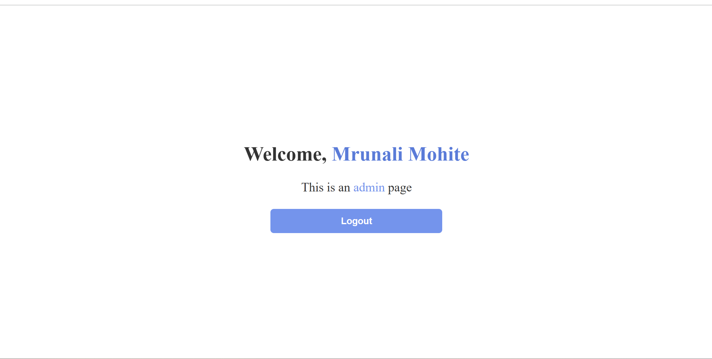

# PHP Login & Registration System

A secure Login & Registration System built with **PHP** and **MySQL**. This project demonstrates user authentication, role-based authorization, password hashing, prepared statements, and session management.

## 🚀 Features

- User Registration
- User Login
- Admin & User Role Authentication
- Password Hashing (`password_hash()`)
- Password Verification (`password_verify()`)
- Prepared Statements (SQL Injection Protection)
- Session-Based Authentication
- Input Validation
- Logout Functionality
- Clean Folder Structure


## 🛠️ Technologies Used

- PHP
- MySQL
- HTML5
- CSS3
- JavaScript
- XAMPP


## 📂 Project Structure

```
LOGIN-SIGNUP/
│
├── admin/
│   └── admin_page.php
│
├── auth/
│   ├── login_register.php
│   └── logout.php
│
├── config/
│   └── database.php
│
├── user/
│   └── user_page.php
│
├── index.php
├── style.css
├── script.js
└── README.md
```


## ⚙️ Installation

1. Clone the repository

```bash
git clone https://github.com/your-username/php-login-registration-system.git
```

2. Move the project to your XAMPP `htdocs` folder.

3. Start **Apache** and **MySQL** from the XAMPP Control Panel.

4. Create a MySQL database (e.g., `login_system`).

5. Import the SQL file into the database.

6. Configure your database connection in:

```
config/database.php
```

Example:

```php
<?php

$conn = new mysqli(
    "localhost",
    "root",
    "",
    "login_system"
);
```

7. Open your browser and visit:

```
http://localhost/LOGIN-SIGNUP/
```


## 🔒 Security Features

- Passwords are securely hashed using `password_hash()`
- Password verification using `password_verify()`
- SQL Injection protection using Prepared Statements
- Session regeneration after successful login
- Role-based access control (Admin/User)
- Input validation


## 📸 Screenshots

### Login Page



### Register Page



### Admin Dashboard



### User Dashboard


## 📚 Future Improvements

- Email Verification
- Forgot Password
- Reset Password
- Remember Me
- CSRF Protection
- Profile Page
- Change Password
- Account Settings

---

## 👨‍💻 Author

**Mrunali Mohite**

GitHub: [https://github.com/your-username](https://github.com/mrunalimohite)

---

## ⭐ If you like this project

Give this repository a ⭐ on GitHub!
